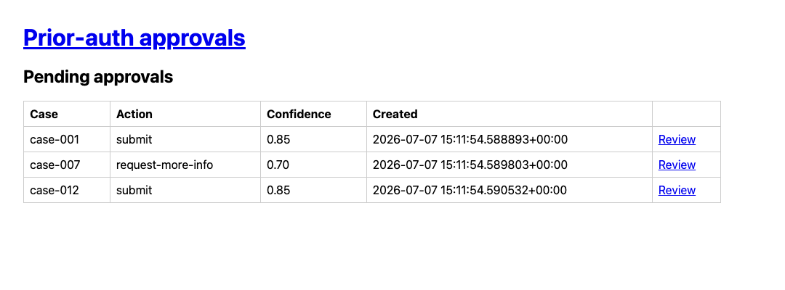
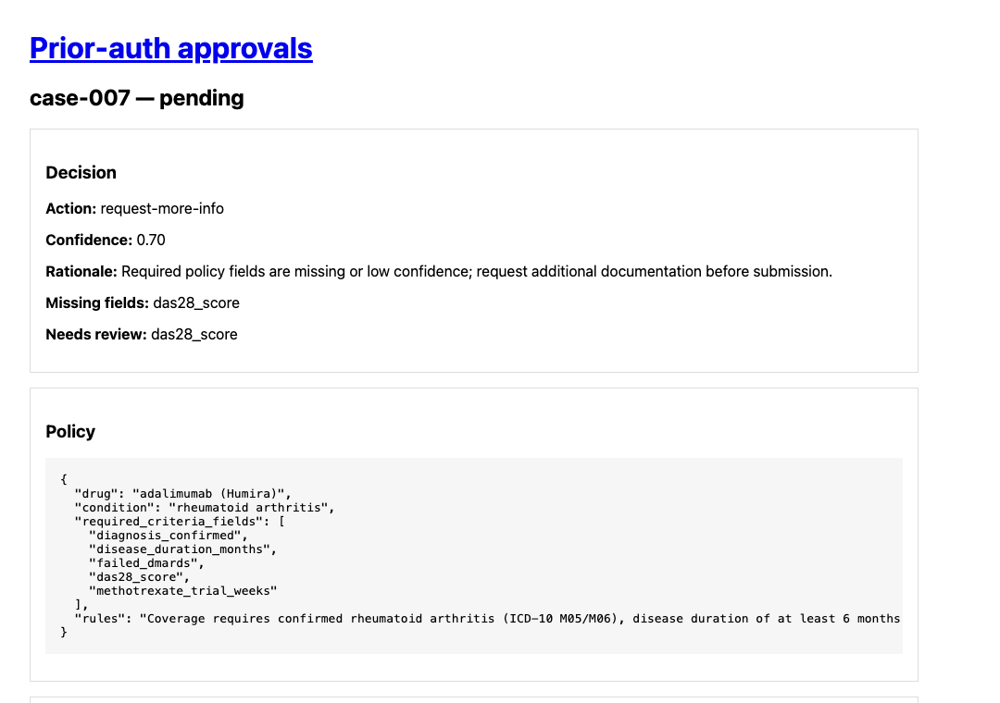

# Clinical Ops Copilot

[](https://github.com/armaangulati1/clinical-ops-copilot/actions/workflows/ci.yml)
[](https://www.python.org/downloads/)
[](LICENSE)
[](pyproject.toml)

An AI agent that reads a patient's chart, checks it against their insurance company's rules, and prepares prior-authorization paperwork for clinic staff to approve — so patients get their medication days faster.

**[Demo (2 min)](https://www.loom.com/share/2368c0f132fa4d2e8960dac7682592ff)** · **[Live API health](https://clinical-data-mcp.fly.dev/health)** · **[Tests](#tests)** · **[MIT License](LICENSE)**

---

## Demo

- 🎥 **2-minute walkthrough (Loom):** [Watch here](https://www.loom.com/share/2368c0f132fa4d2e8960dac7682592ff)
- 🎥 **60-second FHIR + provenance demo (Loom):** [Watch here](https://www.loom.com/share/b21269ecf13543dba2d2772db90a9650)
- 🚀 **Live demo:** [clinical-data-mcp.fly.dev/health](https://clinical-data-mcp.fly.dev/health) *(deployed read-side service; full live demo coming soon)*
- 🎙️ **Voice interface prototype (Loom):** [Watch here](https://www.loom.com/share/e06dfcb217134c7cabfb2f395e8f48b5) *(spoken question in, spoken decision out — code on the [`voice-prototype`](https://github.com/armaangulati1/clinical-ops-copilot/tree/voice-prototype) branch)*

The human approval gate in action — the agent triages each case, and nothing happens until a staff member clicks Review:



When the chart is missing a required field, the agent asks instead of guessing — and names exactly what's missing:



---

## What this does

- **Reads patient charts automatically** — both free-text doctor's notes and structured electronic health records (FHIR).
- **Checks insurance requirements** — compares what's in the chart against the payer's coverage policy for a drug (e.g., Ozempic).
- **Makes a recommendation** — *submit* the request, *ask for more information*, or *flag a likely denial* before anyone wastes time filing it.
- **Shows its work** — every extracted fact is labeled with where it came from (the note or a specific lab result in the EHR).
- **Keeps a human in charge** — no email is sent and no task is created until a staff member reviews and approves it in a simple web UI.
- **Protects patient privacy** — names, record numbers, and other identifiers are scrubbed from every log.

---

## Why it matters

Prior authorization is one of the biggest sources of friction in US healthcare. Before a pharmacy can fill many medications, clinic staff must prove to the insurer that the patient meets its coverage criteria — digging through charts, filling out forms, and faxing documentation. The American Medical Association reports that practices complete dozens of these requests per physician every week, and delays or denials directly postpone patient care.

Most of that work is mechanical: *find the A1C value, confirm the patient tried metformin, check the BMI, match it all against the payer's checklist.* That's exactly what this agent automates — while deliberately **not** automating the judgment call. A human approves every outward-facing action, and the system is engineered to fail safely: when it can't find a required field, it asks for more information instead of guessing.

The result: staff review a pre-checked, source-cited recommendation in seconds instead of assembling one over 20+ minutes, and likely denials are caught before they're filed.

---

## Features

- **Dual data sources** — fuses live EHR data (FHIR/HAPI) with LLM extraction from free-text notes, with per-field provenance and graceful fallback when the EHR is down.
- **Three-way triage decisions** — submit / request-more-info / deny-risk, with a deterministic guardrail that routes incomplete cases to "request more info" rather than letting the model guess.
- **Human approval gate** — every state-changing action (emails, tasks) is held for explicit approval in a FastAPI + HTMX web UI, with a full audit trail.
- **Measured, not vibes-checked** — a locked eval split, regression gate in CI, and a dedicated FHIR eval harness with honest caveats published alongside the numbers.
- **Safety engineering** — PHI redaction on all logs and audit events, prompt-injection guards on tool arguments, chart-path sandboxing, idempotent action execution (verified under 30% injected failure).
- **Speaks the payer's format (X12 278):** ingests a standard prior-auth EDI request and returns a standard EDI response, so the agent can sit inline with how insurers and clearinghouses actually exchange authorizations (synthetic data, demo-scope subset).
- **Reads the paperwork and checks the portal (demo-scope):** OCR intake for scanned decision letters and a Playwright agent that reads status back from a synthetic payer portal, both synthetic-only.
- **Production-shaped architecture** — two MCP servers (read-side deployed on Fly.io, action-side local), typed FHIR client, CI with lint + strict typing + 188 CI tests (215 total incl. network).

---

## For Engineers

Everything below is the full technical documentation: benchmarks, architecture, run instructions, and caveats.

### Results

*Source: `evals/results/locked_test.json` (n=16, locked split), `evals/results/tuning_comparison.md`, `tests/test_clinic_ops_reliability.py`. Model: `claude-sonnet-4-5`.*

| Metric | Value |
|--------|------:|
| **Macro-F1 (locked test, n=16)** | **0.9373** |
| Pre-fix full-48 baseline macro-F1 | 0.844 |
| Accuracy (locked test) | 0.9375 |
| **deny-risk recall** | **1.000** (was **0.600** pre-fix) |
| submit F1 / recall | 0.9231 / 1.000 |
| request-more-info F1 / recall | 0.8889 / 0.800 |
| deny-risk F1 / precision | 1.000 / 1.000 |
| Trajectory correctness | 68.75% *(strict rubric; action-mapping variants often warn)* |
| Latency p50 / p95 | 10,498.08 ms / 13,328.36 ms |
| Avg cost / case | $0.017478 |
| **Reliability (clinic-ops chaos tests)** | Completes under **30%** injected failure rate; **40/40** idempotent `send_email` ops → **40** backend sends (no doubles); **20/20** action bundles complete once per key |

**Caveats:** Synthetic cases with human-confirmed labels; locked test n=16 (wide CIs). Email LLM judge validated on 8 human ratings (0% exact agreement, MAE 1.38, Pearson r ≈ −0.29) and **excluded from scoring**. Remaining decision errors stay **overconfident** (~0.95 on failures, e.g. locked `case-039`).

### FHIR integration (Phases 0–6)

An agentic prior-auth system that reads **live EHR data via FHIR** (HAPI + Synthea), fuses structured FHIR facts with free-text note extraction (with per-field provenance), routes actions through a **human approval gate**, and is measured by a dedicated FHIR eval harness.

*Source: `evals/results/fhir.json`, `evals/results/fhir_guardrail_comparison.md` (n=12 Ozempic/T2D cases, `claude-sonnet-4-5`).*

#### Results (deltas first)

| What changed | Before | After |
|--------------|--------|-------|
| **FHIR fusion vs note-only** (macro-F1) | **0.2456** note-only | **1.0000** FHIR path |
| **Missing-field guardrail** (request-more-info recall, FHIR path) | **0.286** (2/7) planner only | **1.000** (7/7) planner + guardrail |
| **deny-risk recall** (FHIR path, both runs) | **1.000** (4/4) | **1.000** (4/4) — legitimate denials preserved |

**Caveats:** Small **n ≈ 12**; **synthetic Synthea** patients on local HAPI; a **decision-logic eval** (labels = payer policy applied to the same FHIR facts the agent reads, not independent chart review); **one guardrail iteration** informed by the held-out aggregate. Do not read the post-guardrail run as production accuracy.

#### FHIR architecture

```
┌──────────────────┐     stdio MCP      ┌─────────────────────┐
│ Agent            │───────────────────►│ clinical-data MCP   │
│ planner +        │                    │ CLINICAL_DATA_      │
│ guardrails +     │     stdio MCP      │ SOURCE=fhir         │
│ approval gate    │───────────────────►│ clinic-ops (actions)│
└──────────────────┘                    └──────────┬──────────┘
                                                   │ FHIR REST
                                                   ▼
                                        ┌─────────────────────┐
                                        │ FhirClient          │
                                        │ → HAPI FHIR         │
                                        │ ← Synthea bundles   │
                                        └─────────────────────┘
```

Fusion and provenance live in `agent/fhir_facts.py`; FHIR-down fallback and PHI-safe logging in `agent/fhir_resilience.py` and `schemas/fhir_redaction.py`.

#### How to run (local FHIR path)

```bash
make fhir-up                    # HAPI on :8080
make load-synthea               # once: load ~119 Synthea patients

export CLINICAL_DATA_SOURCE=fhir
export FHIR_BASE_URL=http://localhost:8080/fhir
export ANTHROPIC_API_KEY="<your key>"   # never commit .env

uv run evals --fhir             # always local stdio MCP + HAPI (ignores CLINICAL_DATA_URL)
```

Single-case demo with provenance: [watch the 60-second Loom](https://www.loom.com/share/b21269ecf13543dba2d2772db90a9650) or see [docs/fhir_demo_script.md](docs/fhir_demo_script.md).

**Docs:** [docs/fhir_teardown.md](docs/fhir_teardown.md) · [evals/fhir/LABEL_REVIEW.md](evals/fhir/LABEL_REVIEW.md)

### X12 278 prior-authorization layer

Payers and clearinghouses exchange prior authorizations as **X12 278**
health-care-services-review transactions, not JSON. This layer (`edi/`) lets the
agent sit inline with that format: a hand-rolled parser reads a **278 REQUEST**
(005010X217 subset) into the agent's existing `Case` input, and a generator
emits a **278 RESPONSE** from the agent's decision. No EDI dependency: the
tokenizer bootstraps delimiters from the ISA header by position and splits
segments/elements/components explicitly.

**Role framing:** the agent's decisions are provider-side. The response
generator **simulates the utilization-review (payer/UMO) side** for demo
purposes, showing what a payer-side determination would look like given the
agent's assessment. It is pre-adjudication demo output, not a claim that the
agent is a utilization-management organization or issues real determinations.

**Honest scope:** a *simplified subset* of the 005010X217 spec, **synthetic data
only**, **not HIPAA-certified EDI tooling** (no SNIP validation, no TA1/999
acks, no companion-guide conformance). Demo/portfolio interoperability layer.

**Supported segments (REQUEST → `Case`):** `ISA`/`GS`/`ST` envelope, `BHT`
(→ `case_id`), `HL` loops (20/21/22/EV), `NM1*PR|1P|IL` (payer / provider /
patient + member id), `UM` (services-review metadata, **required**), `DTP*472`,
`HI` (ICD-10 `ABK`/`ABF`/`BK`/`BF`), `MSG` (clinical narrative), `REF*ZZ`
(policy-lookup carriers), `SE`/`GE`/`IEA`. Unmapped segments are ignored, not
errors. Two documented demo simplifications: the clinical note is inlined across
`MSG` segments (a real 278 attaches it via PWK/275), and the exact drug +
condition policy-lookup keys ride in `REF*ZZ` segments.

**Decision → HCR mapping (RESPONSE):**

| Agent decision | HCR01 | Meaning |
|----------------|-------|---------|
| `submit` | `A1` | Certified in Total |
| `request-more-info` | `A4` | Pended, more documentation needed |
| `deny-risk` | `A4` | Pended for human review, **not** `A3` (denied) |

`deny-risk` maps to **pended, not denied**: it is a risk flag behind the human
approval gate, not a denial authority, so the automated layer never issues an
`A3`. Only a human downstream can.

**Malformed EDI** is handled with structured errors, never crashes: empty input,
truncated ISA, non-distinct delimiters, and missing required segments each raise
a specific `X12ParseError` subclass.

**Eval wire-in (ingestion fidelity):** the locked held-out split's cases are run
through both the native path and the 278 round-trip (encode, parse, back to
`Case`) under the same deterministic offline decider (regex extractor +
`StubPlanner` + the repo's real required-field guardrail, not a test double).
Result: **16/16 (100%)** decision agreement, so the EDI round-trip changes no
decision. The round-trip uses the repo's own encoder, so this is a
self-consistency test of the parser and mapping, not third-party 278
conformance. On this split the offline decider produces 12 `submit` and 4
`request-more-info` decisions and 0 `deny-risk`, so the eval exercises only the
submit and request-more-info classes. The `deny-risk` to A4 mapping is covered
by unit tests, not by this eval. This measures ingestion fidelity, not clinical
accuracy vs ground truth; the locked split and its labels are read-only.

```bash
python -m edi.eval_agreement          # prints per-case + 16/16 agreement
uv run pytest tests/test_x12_278_*.py -q
```

Full detail, segment table, and fixtures: [edi/README.md](edi/README.md).

### HL7 v2 ingestion demo (subset)

Most hospital feeds still move over **HL7 v2** pipe-and-caret messages, not FHIR.
This layer ingests a documented **v2.x subset** so the same copilot can accept
that legacy format: a hand-rolled, dependency-free parser reads the encoding
characters from the MSH header and parses two message types into the copilot's
**existing** ingestion boundaries.

- **`ADT^A01` (admit)** → a `PatientContext` whose `patient_id` is the same
  identity key `Case.patient_id` carries (the X12 278 layer fills that field
  from `NM1*IL`; this fills it from `PID-3`).
- **`ORU^R01` (observation result)** → an `agent.fhir_facts.FhirClinicalBundle`,
  the exact `observations_by_loinc` structure the **unchanged** FHIR fact
  resolver already consumes. A LOINC-coded ORU therefore resolves prior-auth
  observation fields (A1c, BMI) through `resolve_fhir_facts` with **zero change**
  to the agent decision path.

**Honest scope:** a v2 **subset** (ADT^A01 admit + ORU^R01 result only; MSH, EVN,
PID, PV1, OBR, OBX), **synthetic self-authored messages only** (invented
patients and facilities, no real MRNs/PHI), deterministic and offline. It is
**not a certified HL7 interface engine**: no MLLP framing, no ACK generation, no
Z-segment or conformance-profile handling, no full data-type validation, and it
is **not affiliated with any company**. Pipe/caret/tilde encoding, repeating
fields, and `\F\`/`\S\` escape sequences are handled; unknown segments are
tolerated and ignored. Malformed input (empty, missing MSH, truncated MSH,
non-distinct delimiters, unsupported version or message type, missing required
segments) raises a specific `HL7ParseError` subclass, never crashes.

**Eval (exact match):** each well-formed fixture is checked against committed
goldens for **both** the parsed message and the boundary mapping.

| Fixture | parsed | mapped |
|---------|:------:|:------:|
| `adt_a01_admit_basic` | ok | ok |
| `adt_a01_admit_repeat_ids` | ok | ok |
| `oru_r01_a1c_bmi` | ok | ok |
| `oru_r01_escaped` | ok | ok |
| `oru_r01_metabolic_panel` | ok | ok |
| `oru_r01_mixed_types` | ok | ok |

Result: **6/6 (100%)** exact match on its self-authored HL7 v2 set. This is a
self-consistency check of the parser and the two mappings against goldens the
repo authored, not third-party HL7 conformance certification.

```bash
python -m hl7v2.eval            # prints the per-fixture table + 6/6
uv run pytest tests/test_hl7v2_*.py -q
```

Full detail, segment table, and fixtures: [hl7v2/README.md](hl7v2/README.md).

### OCR intake and browser-agent layers

Two demo-scope layers that extend the prior-authorization workflow to the two
intake/egress edges a deployment engineer touches on prior-auth work: reading
scanned decision letters (OCR) and reading status back out of a payer portal
(browser automation).

#### What is demonstrated

**OCR intake (`ocr/`).** Synthetic scanned prior-authorization decision letters
are generated in-repo, run through a tesseract OCR pipeline, and parsed into a
structured `LetterRecord` (case id, decision, auth number, drug, condition,
dates) with a tolerant field parser that handles OCR noise. A field-level
accuracy eval scores parsed records against known ground truth.

**Browser agent (`browser_agent/`).** A self-built synthetic payer portal
(FastAPI, two pages) is driven by a Playwright agent: log in, submit a case-id
lookup, and read the authorization status from the DOM into a structured
`PortalStatus`. A round-trip demo checks the statuses the agent scrapes against
the portal's own source data.

#### Honest scope

- **Synthetic letters, generated in-repo.** The OCR fixtures are rendered from
  templates by `ocr/generate_fixtures.py` (Pillow). Names and case ids are
  invented. There is no PHI anywhere in the pipeline.
- **Self-built demo portal.** The browser agent drives a local FastAPI app in
  this repo (`browser_agent/portal/`), clearly labeled synthetic in-page and in
  code. It does not resemble, proxy, or connect to any real payer website. This
  is not RPA against a real payer system.
- **Self-consistency evals, not external validation.** The portal round-trip
  compares what the agent scrapes to the portal's own source JSON. Agreement
  shows the agent navigates and scrapes correctly. It does not validate any
  external system. The OCR eval scores against ground truth we generated
  ourselves, so the accuracy number reflects a controlled synthetic set, not
  real-world payer-letter accuracy.
- **Demo-scope only.** These layers are demonstrations of the techniques (OCR
  field extraction, browser automation) on synthetic data. They are not
  hardened intake or automation systems.

#### Accuracy (measured)

Field-level accuracy of the OCR pipeline over the 12 committed synthetic
letters (`uv run python -m ocr.eval_ocr`):

| field          | correct / total | accuracy |
|----------------|-----------------|----------|
| case_id        | 12 / 12         | 100.0%   |
| patient_name   | 12 / 12         | 100.0%   |
| decision       | 12 / 12         | 100.0%   |
| drug           | 12 / 12         | 100.0%   |
| condition      | 12 / 12         | 100.0%   |
| auth_number    | 12 / 12         | 100.0%   |
| decision_date  | 12 / 12         | 100.0%   |
| valid_through  | 12 / 12         | 100.0%   |
| **OVERALL**    | **96 / 96**     | **100.0%** |

Four of the twelve letters are deliberately degraded (Gaussian blur, speckle
noise, and rotation) to simulate low-quality scans. Raw tesseract output on
those does contain real errors: for example, on `letter_11` the label "Case ID"
is read as "Case 1D", and disclaimer text clips at the rotated page edge. The
tolerant parser recovers the field values from that noisy text (case-insensitive
labels, whitespace collapse, a light OCR-confusion remap on the numeric tail of
code fields, and tolerant matching of the "ID" label), which is why field
accuracy lands at 100% despite the raw OCR noise. The number is honest but
controlled: it is 100% on a synthetic set we generated and scored ourselves, not
a claim about real payer letters.

The browser round-trip (`uv run python -m browser_agent.demo`) reports 12 / 12
statuses matching the portal source (0 mismatches).

#### Run commands

```
# One-time system deps (macOS)
brew install tesseract
uv add pillow pytesseract playwright   # already in pyproject
uv run playwright install chromium

# OCR: regenerate fixtures and score accuracy (off macOS, regeneration uses
# fallback fonts, so rendered PNGs and scores may differ from the table above)
uv run python -m ocr.generate_fixtures
uv run python -m ocr.eval_ocr

# Browser agent: run the synthetic-portal round trip (also writes screenshots)
uv run python -m browser_agent.demo
```

#### Tests

CI-safe tests (run under the standard gate, no tesseract/chromium needed):

- `tests/test_ocr_parser.py`: parser on hand-written raw-text samples,
  including OCR-noise samples, empty and garbage input.
- `tests/test_ocr_generate.py`: fixture-generation determinism and structure.
- `tests/test_portal_routes.py`: portal routes via `TestClient`, plus a
  cross-check that the portal case ids match the OCR ground truth.

Tool-dependent tests (marked `ocr` / `browser`, excluded from the CI gate and
self-skipping when the tool is absent):

- `tests/test_ocr_pipeline.py` (`ocr`): full OCR over the fixtures, accuracy
  floor, malformed/empty-image handling.
- `tests/test_browser_agent.py` (`browser`): Playwright agent login, lookup,
  bad-password and unknown-case errors, full self-consistency demo.

The CI gate runs `pytest -m "not network and not ocr and not browser"`, so the
tesseract/chromium tests never run on CI runners that lack those tools.

#### Evidence

Screenshots of the portal flow, captured by the agent during the demo:

- `browser_agent/evidence/01_login.png`
- `browser_agent/evidence/02_lookup_form.png`
- `browser_agent/evidence/03_status_result.png`

### System architecture

```
┌─────────────┐     ┌──────────────────────────────────────┐
│  Approval   │     │  Agent (planner + guardrails + logs) │
│  UI :8080   │────►│  MCP client                          │
└─────────────┘     └───┬──────────────────────┬───────────┘
                        │ StreamableHTTP+auth  │ stdio
                        ▼                      ▼
              ┌─────────────────┐    ┌─────────────────┐
              │ clinical-data   │    │ clinic-ops      │
              │ (Fly, Server A) │    │ (local, actions)│
              │ extract, policy │    │ email, tasks, … │
              └─────────────────┘    └─────────────────┘
```

**Safety model:** human approval gate before state-changing clinic-ops tools · deterministic missing-field guardrail (routes submit **or deny-risk** to request-more-info when required fields are null/`needs_review`; legitimate denials with all fields present pass through) · PHI redaction on logs/audit · prompt-injection guard on tool args · chart path sandbox (`data/charts` only on server).

### How to run

#### Quickstart — no credentials needed

Everything in CI runs fully offline (no API key, no deployed services):

```bash
uv sync --dev                        # one command; uv handles Python + deps
uv run pytest -m "not network and not ocr and not browser" -q    # 188 tests: agent, guardrails, gate, PHI redaction, X12 278
uv run python -m ui                  # approval UI at http://127.0.0.1:8080
```

Running the agent end-to-end requires an `ANTHROPIC_API_KEY` (planner) — see below.

#### Prerequisites

```bash
uv sync --dev
cp .env.example .env   # add ANTHROPIC_API_KEY; never commit .env
```

#### Agent (local clinic-ops + deployed clinical-data)

```bash
export CLINICAL_DATA_URL="https://clinical-data-mcp.fly.dev/mcp"
export CLINICAL_DATA_AUTH_TOKEN="<your fly secret>"
export EXTRACTOR_BACKEND=stub
export ANTHROPIC_API_KEY="<your key>"

uv run python -m agent --case case-001
```

Omit `CLINICAL_DATA_URL` to launch clinical-data over stdio locally instead.

#### Approval UI

```bash
uv run python -m ui
# → http://127.0.0.1:8080
```

#### Evals (locked test split)

```bash
uv run evals --split evals/splits/locked_test.json
```

#### Deploy clinical-data (Fly)

See [docs/deploy_fly.md](docs/deploy_fly.md). Redeploy: `fly deploy --ha=false` (stateful MCP requires one machine).

### Tests

```bash
uv run ruff check . && uv run mypy .
uv run pytest -m "not network and not ocr and not browser" -q    # 188 tests, CI gate
```

Post-deploy smoke (optional): `CLINICAL_DATA_DEPLOY_URL=https://clinical-data-mcp.fly.dev uv run pytest -m deploy -q`

### Repo map

| Path | Role |
|------|------|
| `agent/` | Orchestrator, planner, guardrails, MCP host |
| `servers/clinical_data/` | Read-side MCP (deployed on Fly) |
| `servers/clinic_ops/` | Action-side MCP (stdio) |
| `ui/` | Human approval gate (FastAPI + HTMX) |
| `evals/` | Metrics, splits, regression gate, FHIR eval (`evals/fhir/`) |
| `edi/` | X12 278 prior-auth parser + response generator, fixtures, eval wire-in |
| `fhir_client/` | Typed FHIR REST client |
| `docs/teardown.md` | Written post-mortem (employer-facing) |
| `docs/fhir_teardown.md` | FHIR integration post-mortem |
| `docs/demo_script.md` | 2-minute Loom shot list |
| `docs/fhir_demo_script.md` | 60-second FHIR + provenance demo |

### Docs

Full index with suggested reading order: [docs/README.md](docs/README.md)

- [docs/teardown.md](docs/teardown.md) — problem, approach, results, failures
- [docs/fhir_teardown.md](docs/fhir_teardown.md) — FHIR integration: fusion, guardrail, honest deltas
- [docs/demo_script.md](docs/demo_script.md) — demo recording script
- [docs/fhir_demo_script.md](docs/fhir_demo_script.md) — 60s FHIR + provenance shot list
- [docs/safety.md](docs/safety.md) — PHI, injection, approval policy
- [docs/transport_tradeoff.md](docs/transport_tradeoff.md) — why stateful StreamableHTTP
- [evals/results/tuning_comparison.md](evals/results/tuning_comparison.md) — before/after tuning table

---

## License

[MIT](LICENSE)
